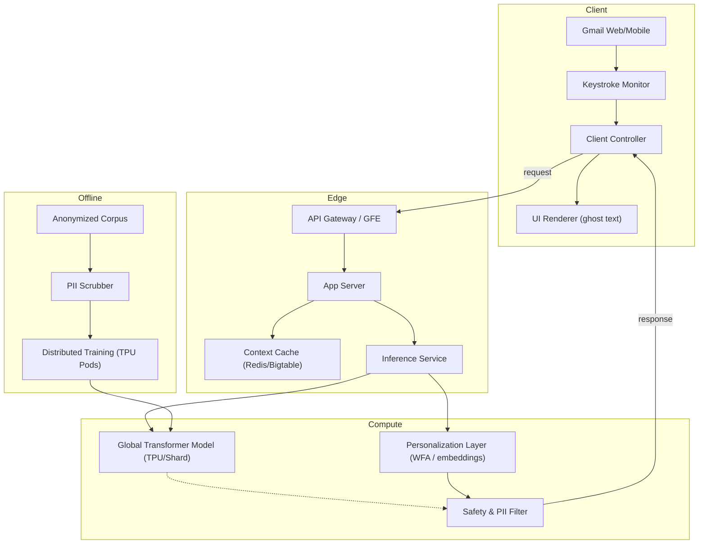
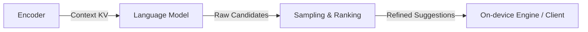
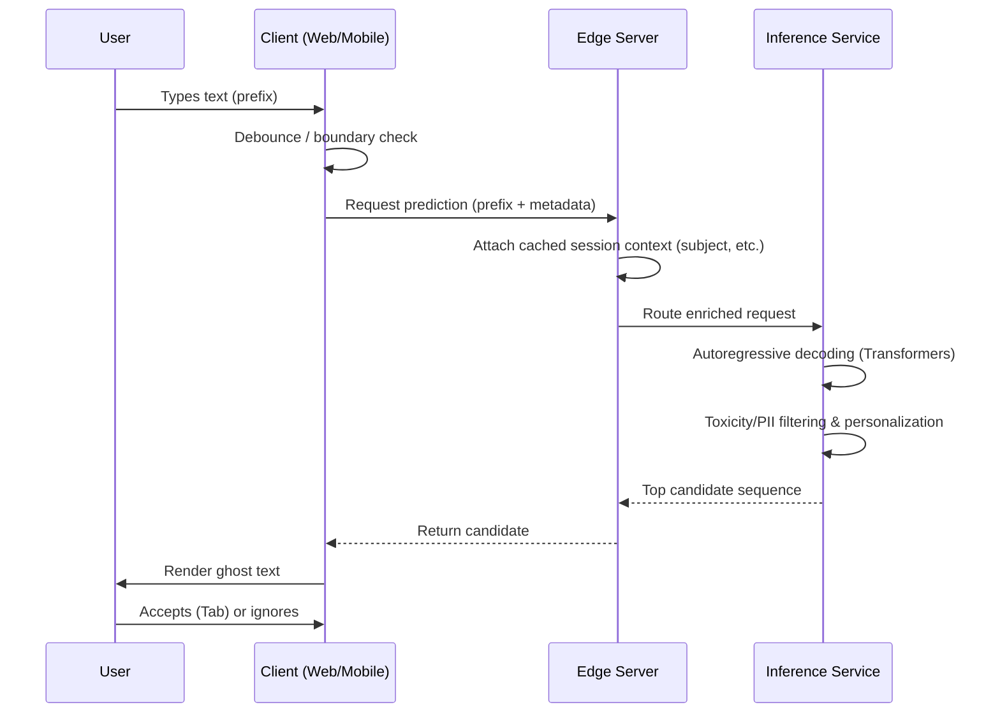

# Gmail Smart Compose

## Objective

Predict and suggest real-time phrase completions for email composition using compact on-device models with cloud validation. Serve over 1.8 billion users globally while balancing latency, accuracy, and rigorous privacy standards [1].

## System Architecture

High-level: the client triggers prediction (debounced), the edge service enriches and caches context, inference returns candidates which are filtered and ranked before client-side rendering. The system adheres to a strict end-to-end backend latency targeted at a P90 of less than 60 milliseconds [4], ensuring the experience remains assistive without feeling intrusive.

## Technical Approach

### ML Model Evolution

- **RNN & LSTM**: Early versions utilized seq2seq RNNs and LSTMs. They averaged word embeddings of the subject and previous message (context) to feed into decoding steps.
- **Transformers**: Shifted to self-attention based architectures for parallelism and long-range dependencies, operating primarily as decoder-only sequence predictors [2, 12].

### Key Components

- **Context Caching**: Encodes fixed context (subject, thread history) into cached Key-Value (KV) pairs so only the newly typed prefix computes attention.
- **Language Model**: Compact Transformers hosted on TPU Pods, quantized (fp32 to int8/bf16) for inference speed [23].
- **Sampling & Ranking Layer**: Uses a very narrow Beam Search (width 1-3) coupled with confidence thresholding to prevent user distraction. 
- **Personalization**: Uses Katz-Backoff N-grams implemented as Weighted Finite Automata (WFA) for lightweight, high-efficiency personal model adaptation [12], which interpolates with the global model.

## Complexity Analysis & Metrics

| Metric | Complexity / Value | Notes |
|--------|-----------:|-------|
| Users Served | 1.8 Billion+ | Global deployment requiring robust load balancing |
| Latency Target | P95 < 60ms | Includes network, 20ms P50 inference [4,8] |
| Typing Saved | 1B+ chars/week | Massively reduces repetitive idiomatic typing |
| Acceptance Rate | > 10% | Threshold for utility without annoyance [26] |

## System Design Interview Framework

In an ML System Design interview ("Design Gmail Smart Compose"), candidates should highlight:

1. **Capacity Estimation**: At ~2.5 trillion requests/day (1.8B users * 5 emails * 50 predictions), peak QPS hits 10-15M.
2. **Bottlenecks vs. Trade-offs**: 
   - Network latency is solved via edge serving, quantization, and context caching.
   - Quality vs. Speed is mitigated by small beam widths and Speculative Decoding (TinyLMs mask latency while cloud TPU logic finishes validating).
3. **API Design**: Needs `user_id`, `subject`, `thread_context`, `current_prefix`, and metadata (locale/timestamp).

## Privacy, Security, and Ethics

Smart Compose relies heavily on privacy isolation:
- **Differential Privacy (DP)**: DP-SGD noise injection prevents individual influence on model weights [28].
- **Federated Learning (FL)**: Future on-device adaptations use Secure Aggregation to train local data without centralizing it [28].
- **Data Scrubbing**: Strict PII normalization (generic tokens like `[NAME]`) before training.

### Pipeline / Data Flow

1. Client triggers after debounce or token boundary and sends `prefix + metadata`.
2. Edge app server attaches session context (cached encoded subject/thread) and routes to inference.
3. Inference service attends to cached context + prefix; decoder produces candidate sequences.
4. Post-processing filters for toxicity/PII and applies personalization interpolation with local signals.
5. Top candidate(s) returned; client renders ghost text and accepts on user action.

## Complexity Analysis

| Metric | Complexity | Notes |
|--------|-----------:|-------|
| Model size | 10–100M params | Small enough for on-device / edge quantization and fast inference |
| Time complexity | O(seq_len) per token | Autoregressive decoding dominates; caching reduces repeated work |
| Space complexity | ~50–200MB | Includes KV cache, model weights (quantized), and personal model artifacts |
| Latency target | p95 < 50ms | Includes network, inference, and post-filtering; client-side tiny LM can mask network delays |
| Throughput target | 1000s reqs/s aggregated | Scale via sharding, batching, and edge replication |

## Pros & Cons

### Pros
- **Contextual Assistance**: Reduces attention residue and saves up to 84% composition time in reply scenarios [7].
- **Scalability**: Custom TPU hardware co-design makes per-keystroke feature affordable at 15M+ QPS.

### Cons
- **Infrastructure cost**: TPUs and Edge replica caches are expensive, demanding massive scale to amortize.
- **Privacy risk**: Managing edge cases like generative extraction requiring deep guardrails.

## References & Citations

1. [Google Help: Use Smart Compose in Gmail](https://support.google.com/mail/answer/9116836?hl=en&co=GENIE.Platform%3DDesktop)
2. [Attention is All You Need / Transformer scale](https://arxiv.org/pdf/1906.00080)
4. [Gmail Smart Compose: Real-Time Assisted Writing (KDD 2019)](https://arxiv.org/pdf/1906.00080)
7. [Integrated Gmail Updates with Improved Looks and Handy: Real Efficiency Gains](https://lifetips.alibaba.com/tech-efficiency/integrated-gmail-updates-with-improved-looks-and-handy)
8. [Google Research: Smart Compose: Using Neural Networks to Help Write Emails](https://research.google/blog/smart-compose-using-neural-networks-to-help-write-emails/)
12. [Weak Learner: Gmail Smart Compose Real-Time Assisted Writing Summary](https://www.weak-learner.com/blog/2019/11/03/gmail-smart-compose/)
23. [What is AI Inference? Complete Guide to AI Model Deployment](https://www.articsledge.com/post/ai-inference)
26. [The KPIs that actually matter for production AI agents](https://cloud.google.com/transform/the-kpis-that-actually-matter-for-production-ai-agents)
28. [Private Federated Learning in Gboard](https://arxiv.org/html/2306.14793v1)
